<h1 align="center">Hi, I'm Devin Norgarb</h1>
<p align="center">Full-stack developer · Embedded systems · Home automation</p>
<p align="center">
  <a href="https://me.devsdev.com">Website</a> ·
  <a href="https://stackoverflow.com/users/4993755/devin-norgarb">Stack Overflow</a> ·
  <a href="https://github.com/DevinNorgarb">GitHub</a>
</p>

<p align="center">
  
  
  
  
  
  
  
</p>

<table align="center">
  <tr>
    <td></td>
    <td></td>
  </tr>
  <tr>
    <td colspan="2" align="center"></td>
  </tr>
</table>

## Featured

| Project | Description |
| --- | --- |
| [devtube](https://github.com/DevinNorgarb/devtube) | Laravel YouTube and online video viewing and download interface |
| [vue-quagga-2](https://github.com/DevinNorgarb/vue-quagga-2) | Barcode reader/scanner component for Vue.js |
| [adonis-js-forum](https://github.com/DevinNorgarb/adonis-js-forum) | Adonis Node.js forum |
| [wakatime-parser](https://github.com/DevinNorgarb/wakatime-parser) | WakaTime wakadump human-readable parser in PHP |
| [mcdeez](https://github.com/DevinNorgarb/mcdeez) | McDonald's app promo screen clone |

## Coding Activity

<!--START_SECTION:waka-->


📊 **This Week I Spent My Time On** 

```text
🕑︎ Time Zone: Africa/Johannesburg

💬 Programming Languages: 
Markdown                 5 hrs 23 mins       ████░░░░░░░░░░░░░░░░░░░░░   15.62 % 
YAML                     4 hrs 47 mins       ███░░░░░░░░░░░░░░░░░░░░░░   13.87 % 
Bash                     4 hrs 14 mins       ███░░░░░░░░░░░░░░░░░░░░░░   12.26 % 
Text                     3 hrs 41 mins       ███░░░░░░░░░░░░░░░░░░░░░░   10.68 % 
JavaScript               3 hrs 16 mins       ██░░░░░░░░░░░░░░░░░░░░░░░   09.46 % 
```

**Timeline**


 Last Updated on 17/06/2026 20:52:07 UTC
<!--END_SECTION:waka-->

<p align="center">
  
</p>
