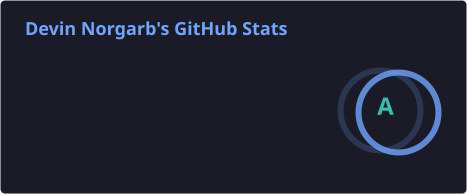
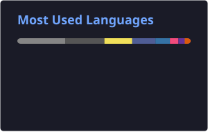

<h1 align="center">Hi, I'm Devin Norgarb</h1>
<p align="center">Full-stack developer · Embedded systems · Home automation</p>
<p align="center">
  <a href="https://devinn.org">Website</a> ·
  <a href="https://stackoverflow.com/users/4993755/devin-norgarb">Stack Overflow</a> ·
  <a href="https://github.com/DevinNorgarb">GitHub</a>
</p>

<p align="center">
  
  
  
  
  
  
  
</p>

<table align="center">
  <tr>
    <td></td>
    <td></td>
  </tr>
  <tr>
    <td colspan="2" align="center"></td>
  </tr>
</table>

## Featured

| Project | Description |
| --- | --- |
| [devtube](https://github.com/DevinNorgarb/devtube) | Laravel YouTube and online video viewing and download interface |
| [vue-quagga-2](https://github.com/DevinNorgarb/vue-quagga-2) | Barcode reader/scanner component for Vue.js |
| [adonis-js-forum](https://github.com/DevinNorgarb/adonis-js-forum) | Adonis Node.js forum |
| [wakatime-parser](https://github.com/DevinNorgarb/wakatime-parser) | WakaTime wakadump human-readable parser in PHP |
| [mcdeez](https://github.com/DevinNorgarb/mcdeez) | McDonald's app promo screen clone |

## Coding Activity

<!--START_SECTION:waka-->


📊 **This Week I Spent My Time On** 

```text
🕑︎ Time Zone: Africa/Johannesburg

💬 Programming Languages: 
Markdown                 6 hrs 13 mins       ███████░░░░░░░░░░░░░░░░░░   29.02 % 
Python                   2 hrs 32 mins       ███░░░░░░░░░░░░░░░░░░░░░░   11.85 % 
Text                     2 hrs               ██░░░░░░░░░░░░░░░░░░░░░░░   09.33 % 
JavaScript               1 hr 54 mins        ██░░░░░░░░░░░░░░░░░░░░░░░   08.87 % 
Other                    1 hr 53 mins        ██░░░░░░░░░░░░░░░░░░░░░░░   08.78 % 
```

🤖 **AI Coding This Week** 

```text
⏱ AI Coding Time: 20 hrs 57 mins (97.64%)

✍️ 25,299 lines written by AI, 2 lines written by hand (99.99% AI-written)

🔤 570,715 Input Tokens, 570,715 Output Tokens

💵 $10.01 Estimated AI Cost This Week

🧠 202 AI Sessions, 692 AI Prompts

Sonnet                   4,002 lines         ███████████░░░░░░░░░░░░░░   44.18 % 
Opus                     2,426 lines         ███████░░░░░░░░░░░░░░░░░░   26.78 % 
Composer                 1,548 lines         ████░░░░░░░░░░░░░░░░░░░░░   17.09 % 
Cursor                   953 lines           ███░░░░░░░░░░░░░░░░░░░░░░   10.52 % 
Grok                     130 lines           ░░░░░░░░░░░░░░░░░░░░░░░░░   01.44 % 

🔎 AI Coding Insights:
🤖 AI-Driven — 99.99% of written lines came from AI
📚 Verbose Prompter — average 3,896 characters per prompt
🔁 Iterative Prompter — average 3 prompts per session
🚀 High AI Trust — 0.01% of changed lines were hand-edited
```

**Timeline**


 Last Updated on 14/08/2026 21:05:39 UTC
<!--END_SECTION:waka-->

<p align="center">
  
</p>
